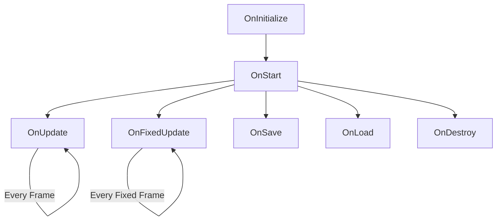

# Modules

A module is similar to
a [MonoBehaviour](https://docs.unity3d.com/6000.1/Documentation/ScriptReference/MonoBehaviour.html), but it is not
attached to any [GameObjects](https://docs.unity3d.com/6000.1/Documentation/ScriptReference/GameObject.html).

You can think of a module as an independent feature or functionality that can be used across different parts of the
game.

## Module Methods

| **Method**                                                                                                                                | **Description**                                                                                | **When Called**              |
|-------------------------------------------------------------------------------------------------------------------------------------------|------------------------------------------------------------------------------------------------|------------------------------|
| **[OnInitialize](https://industrial-valley.github.io/Modding-Documentation/api/api/IndustrialValley.Modules.Module.OnInitialize.html)**   | Initializes the module. Avoid using injected modules here, as they may not be initialized yet. | During module initialization |
| **[OnStart](https://industrial-valley.github.io/Modding-Documentation/api/api/IndustrialValley.Modules.Module.OnStart.html)**             | Starts the module. Injected modules are guaranteed to be initialized at this point.            | After all modules initialize |
| **[OnUpdate](https://industrial-valley.github.io/Modding-Documentation/api/api/IndustrialValley.Modules.Module.OnUpdate.html)**           | Updates logic that runs every frame (e.g., input, animations).                                 | Every frame                  |
| **[OnFixedUpdate](https://industrial-valley.github.io/Modding-Documentation/api/api/IndustrialValley.Modules.Module.OnFixedUpdate.html)** | Handles physics or logic that runs at a fixed interval (e.g., movement, collisions).           | Every fixed frame            |
| **[OnSave](https://industrial-valley.github.io/Modding-Documentation/api/api/IndustrialValley.Modules.Module.OnSave.html)**               | Saves the module’s state.                                                                      | When the game is saved       |
| **[OnLoad](https://industrial-valley.github.io/Modding-Documentation/api/api/IndustrialValley.Modules.Module.OnLoad.html)**               | Loads the module’s state.                                                                      | When the game is loaded      |
| **[OnDestroy](https://industrial-valley.github.io/Modding-Documentation/api/api/IndustrialValley.Modules.Module.OnDestroy.html)**         | Cleans up resources or references when the module is no longer needed.                         | When the module is destroyed |

## Usage

To create a module, you need to inherit from
the [Module](https://industrial-valley.github.io/Modding-Documentation/api/api/IndustrialValley.Modules.Module.html)
class and implement its methods. Here is an example of a simple module:

```cs
public class MyModule : Module
{
    public override void OnStart() {
        // Start code here
    }

    public override void OnUpdate()
    {
        // Update code here
    }  
}
```

The class must be Registered in order for it to be recognized by the game.

```cs
GameManager.RegisterModule<MyModule>();
```

You can inject other modules into your module by using the `Inject` attribute. This allows you to access and use
functionality from other modules. For example:

```cs
public class MyModule : Module
{
    [Inject]
    private AnotherModule anotherModule;

    public override void OnStart() {
        anotherModule.DoSomething();
    }
}
```

You can only inject modules that have been registered and are in an Module file. If you try to inject a module that is
not registered, it will throw an exception.

If you need to access a module in a non-module class, you can use the `GameManager.GetModule<T>()` method to retrieve
it. For example:

```cs
public class MyNonModuleClass
{
    public MyNonModuleClass()
    {
        var bank = GameManager.GetModule<BankModule>();
        
        // This will add $100 to user's bank
        bank.AddMoney(100);
    }

}
```

## Manipulating Modules

There are several methods available to manipulate modules within the game

```cs
GameManager.RegisterModule<T>(); // Registers a module
GameManager.DeleteModule<T>(); // Deletes a module
GameManager.GetModule<T>(); // Gets a module
GameManager.HasModule<T>(); // Checks if a module exists
GameManager.ReplaceModule<T, T>(); // Replaces a module with another one
```

## Module Lifecycle

